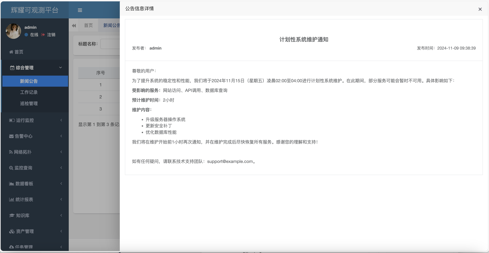
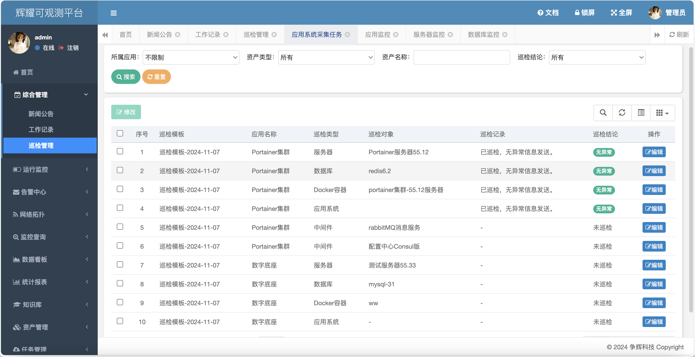
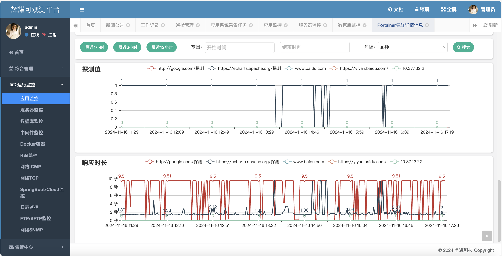
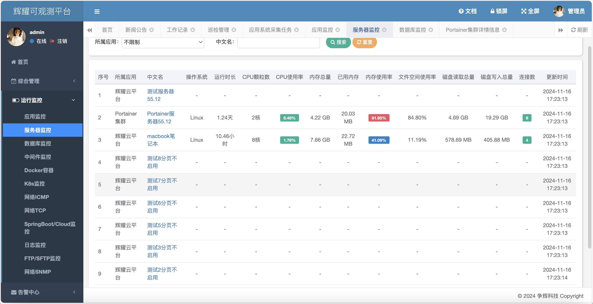
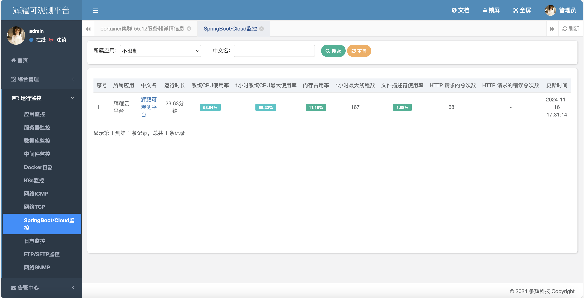
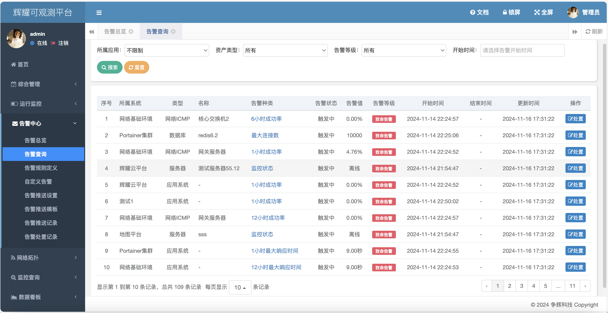
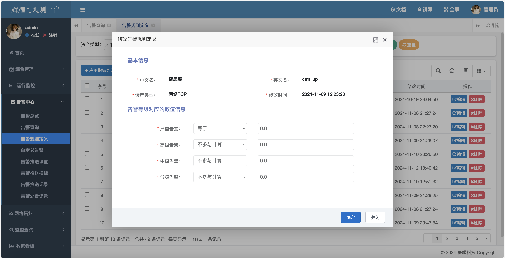

# zhcloud辉耀可观测运维监控平台

### 介绍

Zhcloud辉耀可观测运维监控平台基于微服务springboot架构开发，用户可以轻松实现对服务器、应用程序、网络设备等关键资源的全面监控。平台支持自定义监控指标和告警规则，确保用户能够及时发现并处理潜在问题，有效保障业务的稳定运行。

此外，Zhcloud辉耀可观测运维监控平台还提供了强大的数据分析和可视化功能，帮助用户深入理解系统性能和行为模式。用户可以通过直观的图表和报告，快速识别系统瓶颈和异常，为优化系统性能提供有力支持。

总之，Zhcloud辉耀可观测运维监控平台是一款功能强大、易于使用的运维监控工具，能够帮助用户实现对IT基础设施的全面监控和优化，提升运维效率，保障业务连续性。

核心采集指标包括：服务器、容器Docker、k8s、主流数据库、主流中间件、应用健康度等。

### 技术路线及参数

后端:Spring boot、Jdk8。

数据库：MySQL 8.*、Prometheus。

前端：hplus admin、thymeleaf。

CPU：支持arm64、amd64。

### 安装教程

[安装步骤](doc/install.md)

### 功能说明

1. 中屏首页：显示各类监控对象总数量、最新告警信息、按类型分布的告警状态统计等功能。
2. 综合管理：支持新闻公告查阅、代办工作记录及查阅、设备巡检，其中设备巡检按日巡检模板自动生成、一键生成巡检报告。
3. 运行监控：按业务系统进行分类，支持服务器主机监控、HTTP(S)应用系统健康度监控、中间件监控、数据库监控、Telnet/SNMP/Ping监控、FTP/SFTP监控、日志监控、Spring应用监控等内容；能够对列表和详情的展示指标、展示顺序进行控制，能够绑定告警通过不同告警颜色值进行展示，同时支持是否图表形式显示历史数据，比如折线图显示运行时长。
4. 告警中心：按业务系统进行分类，支持告警总览和告警查询、告警处置功能，同时能够预览告警详情信息；按类型告警规则定义、设置告警阈值，同时支持按业务系统为单位的自定义告警设置；告警推送模板、告警按邮件/短信等推送、告警推送记录。
5. 指标查询：按业务系统进行分类，支持监控指标的历史查询，最终按折线图进行显示，方便运维人员查阅历史记录。
6. 中屏数据看板：提供看板需要的各类数据接口服务，支持3D可视化、2.5D可视化等大屏展示能力。
7. 小屏模式：本平台采用响应式布局开发，对移动端友好。
8. 统计报表：按业务系统进行分类，支持告警总览、资产总览、监控指标总览以及采集任务总览四大模块进行统计与展示。
9. 知识库：采用CMS技术，提供基于栏目的运维知识库管理，包括常见问题、操作指南、故障排查等功能。
10. 资产管理：按业务系统进行分类，对多系统运维友好，支持系统系统、服务器、容器Docker、K8s、数据库、中间件等资产维护管理。
11. 采集任务：通过自定义Agent实现采集任务下发至Prometheus，实现Exporter与运维对象关联；实现告警定时推送等功能。
12. 指标管理：服务器、容器Docker、K8s、数据库、中间件、系统健康度等运行监控指标采集管理。
13. 系统管理：用户管理、角色管理、字典管理、菜单管理、组织管理等。

### 特色功能

* 按业务系统进行分类，支持多个子系统运维管理，一切监控对象资产化管理。
* 基于Prometheus原生支持可观测指标提炼与分析。
* 原生支持Exporter导出器、自定义导出器，扩展能力强。
* 监控指标支持动态添加，非固定死。
* 显示模式基于监控指标，能够动态设置列表是否显示、详情是否显示、显示顺序、显示单位（自动转换可读数值）、是否图表显示、是否禁用等设置。
* 告警规则支持自定义设置，非固定死。
* 巡检模板巡检对象自动生成，一键生成巡检报告。

### 平台截图

### 常用导出器

[导出器安装](faq/exporter%20install.md)

### 常见问题

[常见问题](faq/faq.md)

### 联系方式

QQ群：440033925,欢迎加入。

### 特别鸣谢

[Prometheus平台](https://prometheus.io)

### 参与贡献

@风一样的男子
