# zhcloud辉耀监控平台

### 介绍

Zhcloud辉耀监控平台基于微服务springboot架构开发，用户可以轻松实现对服务器、应用程序、网络设备等关键资源的全面监控。平台支持自定义监控指标和告警规则，确保用户能够及时发现并处理潜在问题，有效保障业务的稳定运行。

此外，Zhcloud辉耀监控平台还提供了强大的数据分析和可视化功能，帮助用户深入理解系统性能和行为模式。用户可以通过直观的图表和报告，快速识别系统瓶颈和异常，为优化系统性能提供有力支持。

总之，Zhcloud辉耀监控平台是一款功能强大、易于使用的运维监控工具，能够帮助用户实现对IT基础设施的全面监控和优化，提升运维效率，保障业务连续性。

核心采集指标包括：服务器、容器Docker、k8s、主流数据库、主流中间件、应用健康度等。

### 技术路线

后端:Spring boot、Jdk8。

数据库：MySQL 8.*、Prometheus。

前端：hplus admin、thymeleaf。

### 安装教程

1. ##### Docker安装：

   prometheus安装


   ```bash
   docker run -d \
           -p 9090:9090 \
           --name prometheus \
           -v /Volumes/D/zhcloud/samba_data/prom-local/data/:/opt/bitnami/prometheus/data/ \
           -v /Volumes/D/zhcloud/samba_data/prom-local/conf/:/opt/zhtec/prom/conf/ \
           docker.hub.cn.com/bitnami/prometheus:2.54.0 \
           --config.file=/opt/zhtec/prom/conf/prometheus.yml \
           --web.enable-lifecycle
   ```

   alertmanager安装

   ```bash
   docker run -d --name alertmanager \
           -p 9093:9093 \
           -v /Volumes/D/zhcloud/samba_data/am-local/conf/config.yml:/opt/bitnami/alertmanager/conf/config.yml \
           docker.hub.cn.com/bitnami/alertmanager:0.27.0

   ```

   4. K8s安装：

### 功能说明

1. 中屏首页：
2. 大屏看板：
3. 运行监控：
4. 指标查询：
5. 告警中心：
6. 资产管理：支持系统系统、服务器、容器Docker、K8s、数据库、中间件等资产维护管理。
7. 采集任务：通过自定义Agent实现采集任务下发至Prometheus，实现Exporter与运维对象关联。
8. 指标管理：服务器、容器Docker、K8s、数据库、中间件、系统健康度等运行监控指标采集管理。
9. 系统管理：用户管理、角色管理、字典管理、菜单管理、组织管理等。

### 平台截图

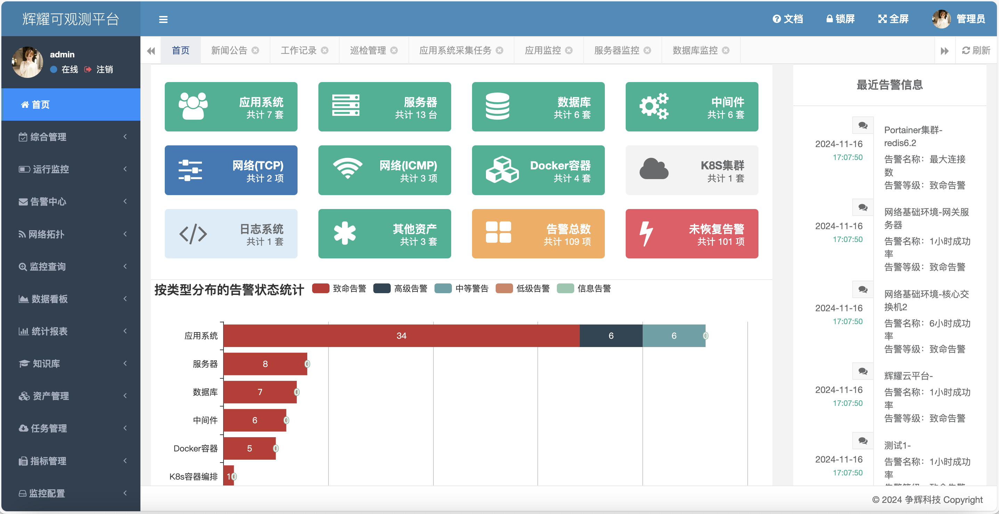

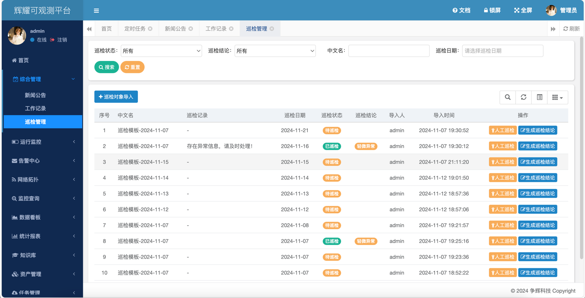

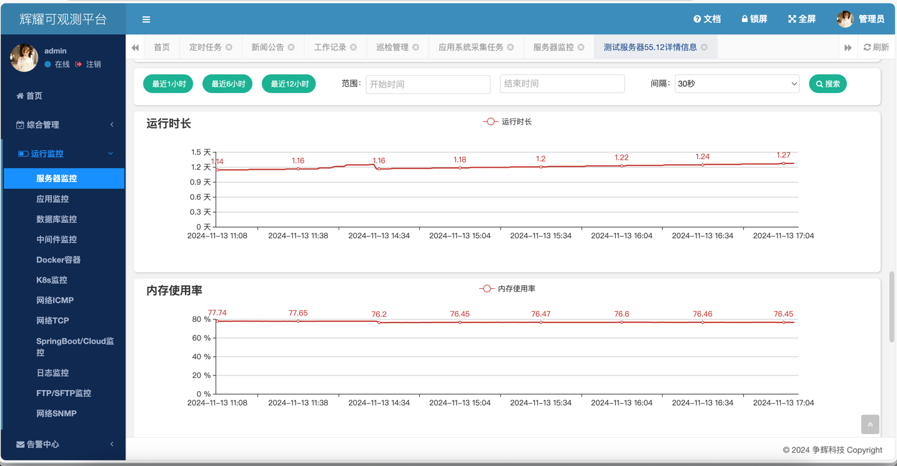

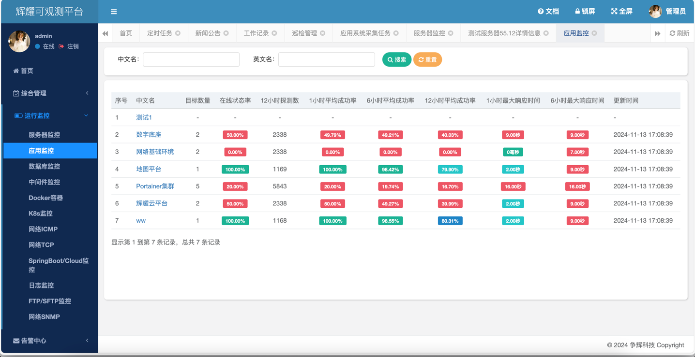

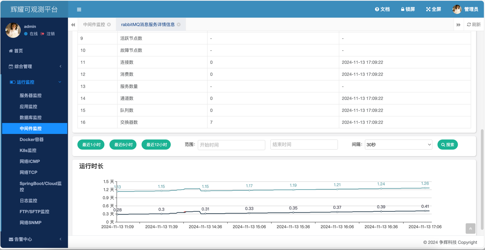

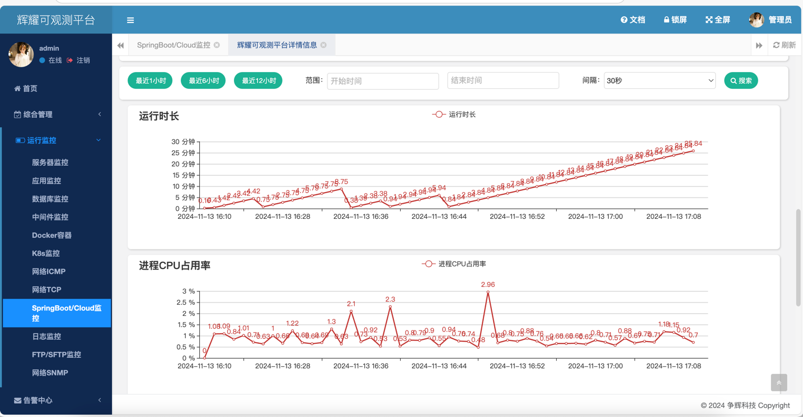

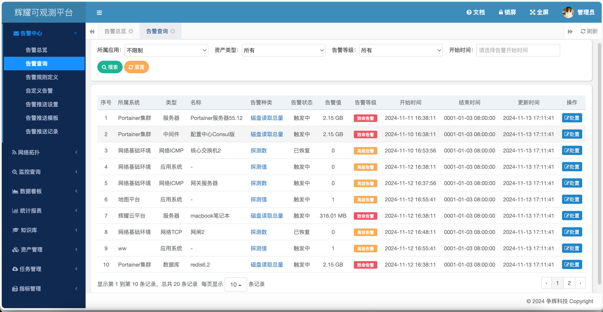

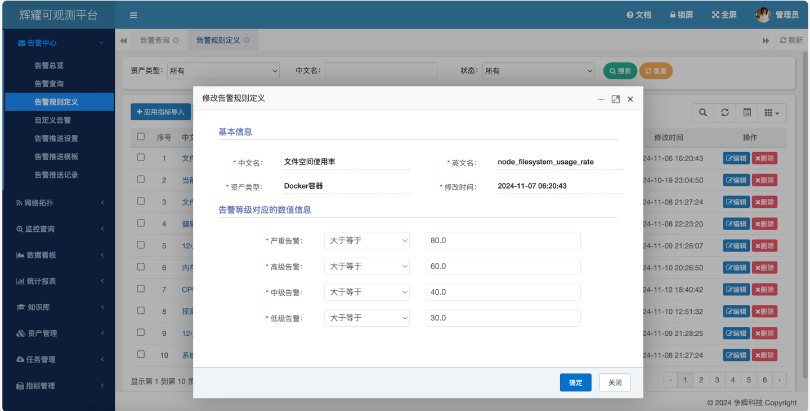

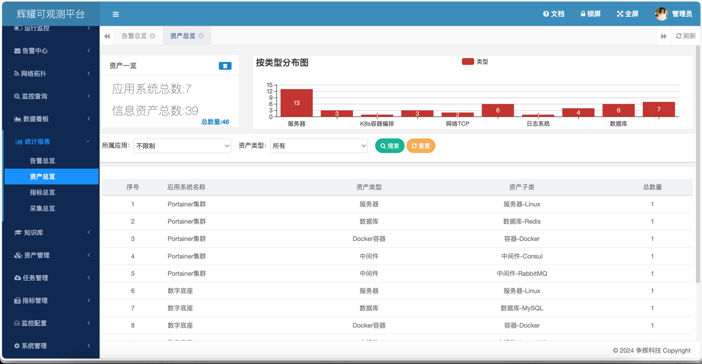
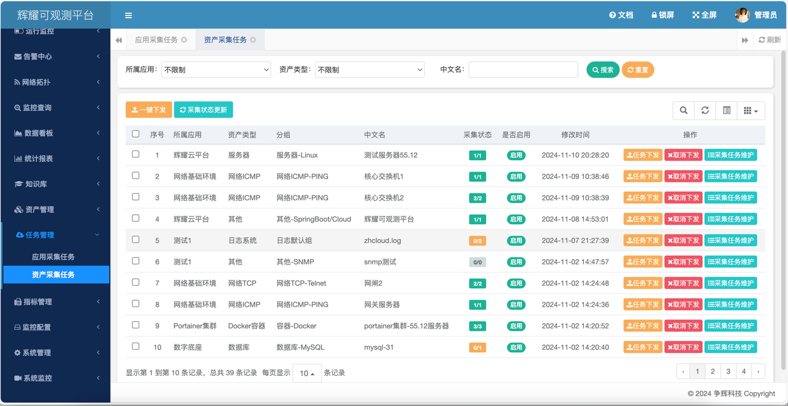
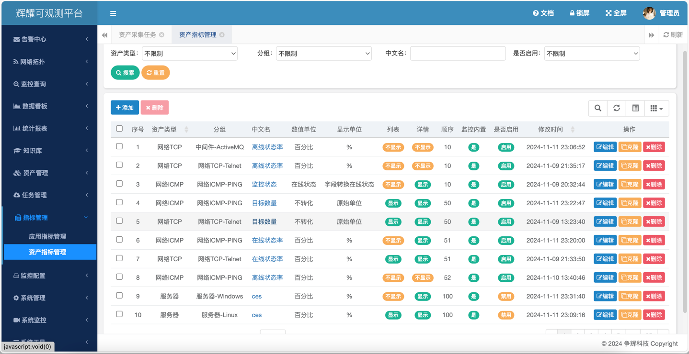
### 常用导出器


### 常见问题


### 特别鸣谢

[若依开发框架](https://)

[Prometheus平台](https://prometheus.io)

### 参与贡献
